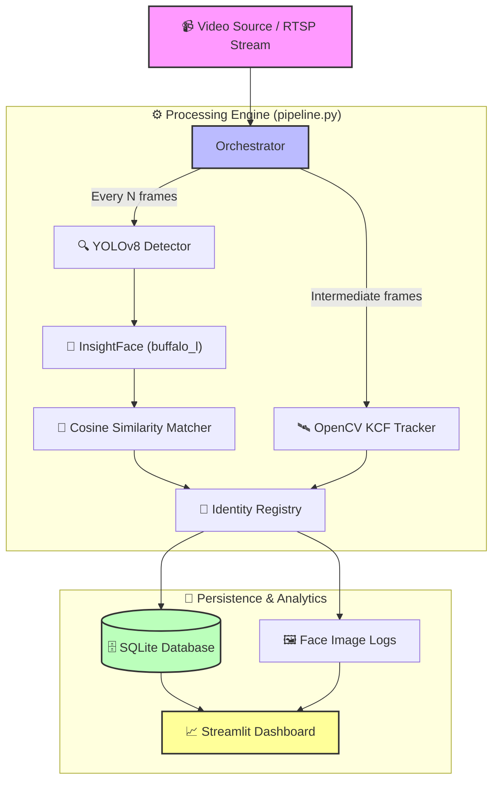

# 📊 Architecture Diagram Prompts

You can use these prompts in different tools to generate a high-quality architecture diagram for your submission.

---

## 🛠️ Option 1: Technical Mermaid Code
**Best for**: Technical reviewers who want to see precision. 
**How to use**: Copy the code below and paste it into [Mermaid Live Editor](https://mermaid.live/).

---

## 🎨 Option 2: AI Image Generator (Visual Prompt)
**Best for**: A "WOW" factor slide in your presentation.
**How to use**: Copy this text into **ChatGPT (DALL-E 3)**, **Midjourney**, or **Canva Magic Media**.

> "A professional, modern 3D isometric technical architecture diagram for an AI Computer Vision system. The diagram shows a clean logic flow starting from a 'Video Input' camera icon, moving through a 'YOLO Face Detection' glowing chip icon, then a 'Face Embedding Neural Network' cube, and finally connecting to a 'Database' icon and a 'Web Dashboard' showing charts. Use a high-tech dark mode aesthetic with blue and purple neon highlights, sleek glassmorphism panels, and clear connecting lines. Label the main sections: Vision Layer, Logic Layer, and Persistence Layer. Cinematic lighting, 8k resolution, minimalist style."

---

## 📝 Option 3: Manual Diagram Description (For PPT / Canva)
**Best for**: Building a custom slide manually.
**Structure**:

1.  **Stage 1: Input (The Eye)**
    *   *Icon*: Video Camera / RTSP Stream.
    *   *Text*: Captures 1080p frames at 30fps.
2.  **Stage 2: Vision Layer (The Brain)**
    *   *Icon*: Neural Network / CPU.
    *   *Text*: YOLOv8 for detection + InsightFace for identity encoding.
3.  **Stage 3: Logic Layer (The Filter)**
    *   *Icon*: Scale / Magnifying Glass.
    *   *Text*: Cosine Similarity compares incoming faces to the database. NEW faces are registered automatically.
4.  **Stage 4: Storage & UI (The Result)**
    *   *Icon*: Server Rack & Tablet.
    *   *Text*: SQLite stores events. Streamlit provides a real-time web dashboard.

---

## 💡 Pro Tip:
If you use the **Mermaid** version, click "Actions" -> "Download SVG" in the editor to get a crystal-clear image you can put directly in your README or presentation!
